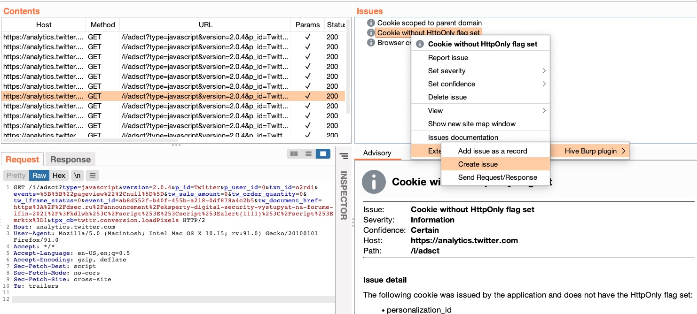
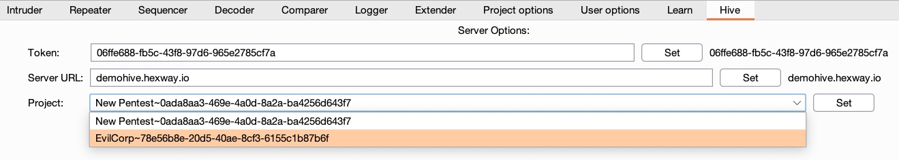

Hive Burp Suite Extension
===================

 

## Description

[Hive](https://hexway.io/hive/) extension for Burp Suite.

This extension allows you to send data from Burp to Hive in one click.
Create issues in Hive, send requests and responses, sitemaps, etc.

 

## Installation

1. Just [add](https://portswigger.net/support/how-to-install-an-extension-in-burp-suite)  `burp-hive.py` as a Burp Extension
2. Configure Hive extension. Set Token (Cookie), Server URL, Project.

  

## Demo

Click on the image to see a demo video

